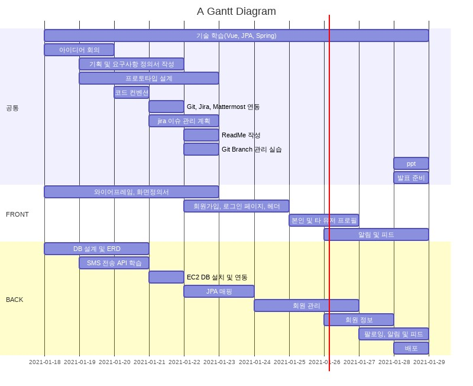
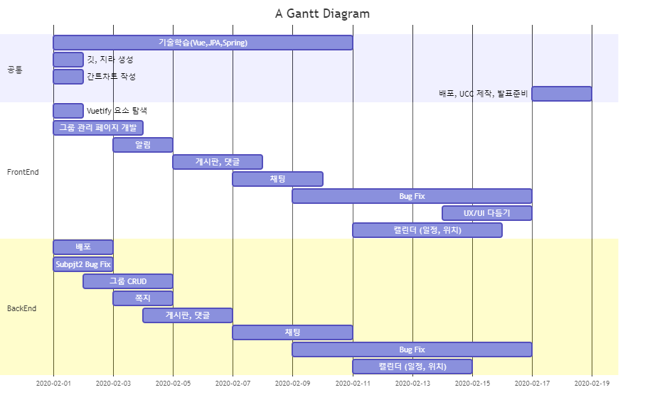
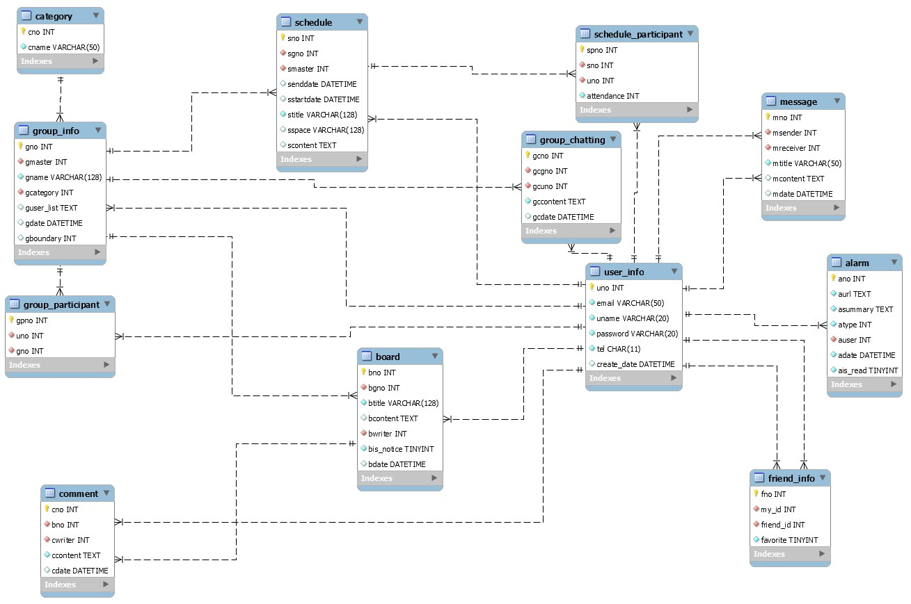
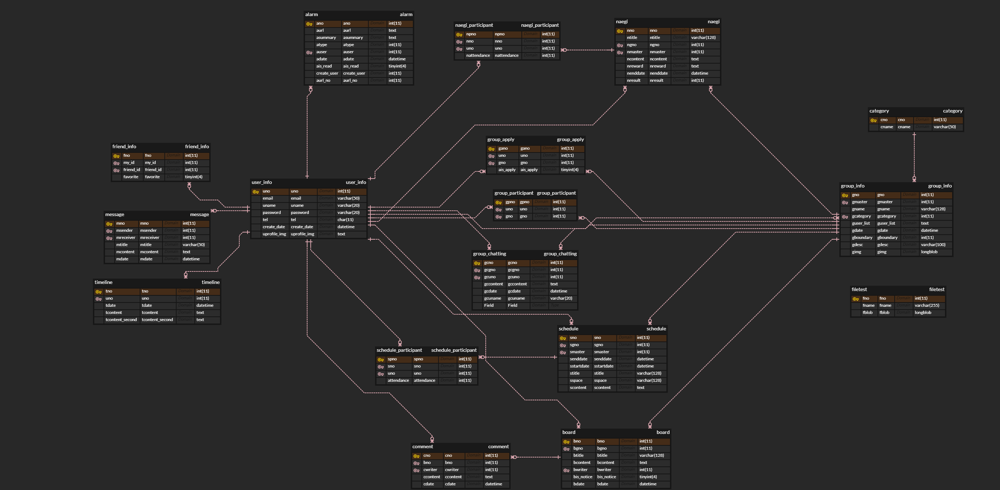

# ReadME.md

- 팀 명: 진영없는 진영팀
- 팀 원: 이하연, 이기호, 박봉현, 임찬규

# 헬프미(헬로우 프렌드 미팅)

### 목차

## 1. 기획의도

---

1. 기존 서비스는 공개된 커뮤니티에서 모든 인원을 대상으로 모집 하는 방식인데 반해 모임의 구성원을 친구 또는 친구의 친구로 제한하여 소극적인 사람도 더 편하게 이용할 수 있는 서비스 제공.
2. 공개된 커뮤니티에서 구성원을 모집하는 경우에  모임의 창설 의도와 다른 의도를 가진 사람들이 들어오는 경우가 현저히 줄어들 것이다.
3. 아는 사람으로 구성된 모임이기 때문에 일반 커뮤니티 사이트와 달리 자신이 책임질 수 있는 행동을 할 것이다.
4. 친구 또는 친구의 친구로 한정된 모임이기 때문에 해당 모임의 주제에 조금의 관심만 있는 사람도 참여하여 진입장벽을 낮출 수 있다.

## 2. 사용기술스택

---

### Frontend

- HTML/CSS
- JavaScript
- Vue.js

### Backend

- Spring Boot
- AWS EC2 (Ubuntu)
- MariaDB

## 3. 기능 요구사항

---

요구사항 명세서 참조.

## 4. Gantt chart

---

## 5. ERD

---

## 6. 실행화면

.jpg)

.jpg)

.jpg)

.jpg)

.jpg)

.jpg)

.jpg)

.jpg)

.jpg)

.jpg)

.jpg)

.jpg)

.jpg)

.jpg)

.jpg)

.jpg)

.jpg)

## ※ 개발 규칙

---

### Java

[Naming 규칙]

- Class는 Pascal 표기법
ex) MainController.java, UserDto.java
- Method, Variable은 Camel 표기법
ex) public void setUserName();
ex) private String userId();
- Method는 동사+명사 형태
ex) getUserId();
ex) selectAll();

[Statement 규칙]

- 

### JavaScript

### GIT

- Develop 브랜치에서 작업
- Master는 건들지 않는다
- 기능마다 임시 branch를 생성해 작업

    ex)기능FF/BF-기능이름-담당자 (ex. FF01-user-hana)

- 적어도 Story이슈 하나마다 커밋
- Commit Message
[ADD/UPDATE/DELETE] #이슈번호 파일명 하고싶은 말
(ex. [UPDATE] #78 UserController.java, UserDto.java 오타 수정)